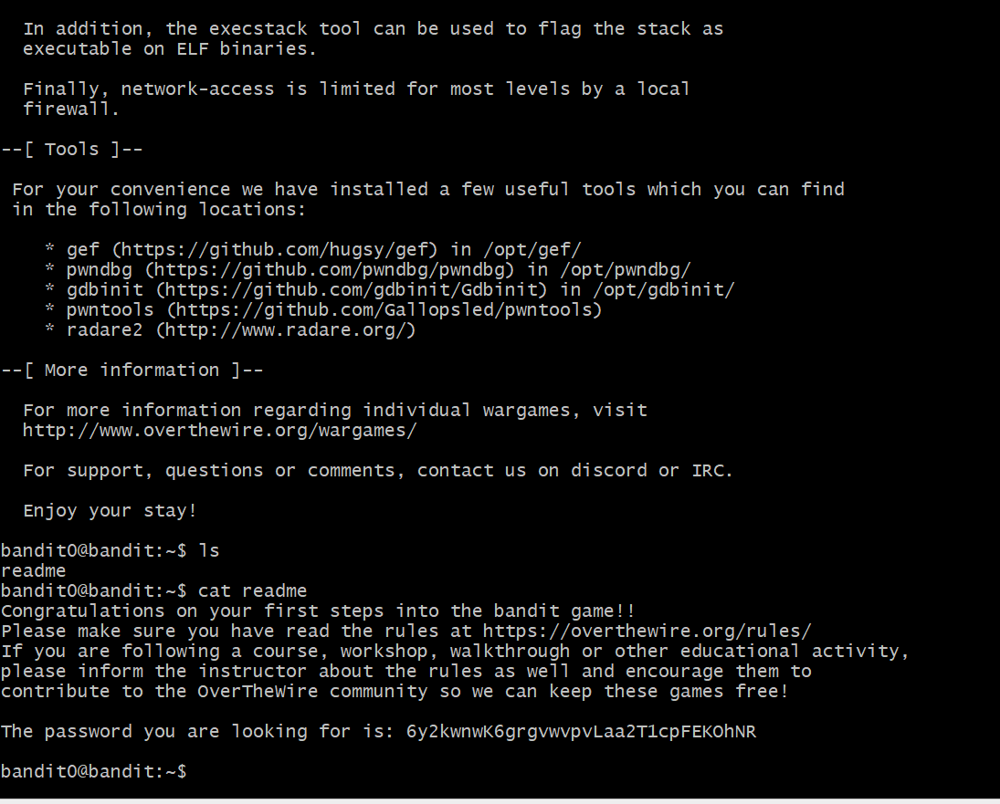

# OverTheWire-Bandit-Labs

A complete step-by-step documentation and write-up of my solutions for the OverTheWire Bandit wargame, featuring explanations, terminal commands, and screenshots for every level.

---

## Level 0 → Level 1
**Goal:** Connect to the game using SSH and retrieve the password for the next level from a file named `readme` located in the home directory.

**Commands Used:** `ssh`, `ls`, `cat`

**Explanation:** 
1. Use SSH to connect to the OverTheWire server with username `bandit0` on port `2200`. The password for level 0 is `bandit0`.
2. Run `ls` to list the files in the current directory.
3. Use `cat readme` to print the contents of the file, which contains the password for Level 1.

**Screenshot:**

---

## Level 1 → Level 2
**Goal:** Read the password from a file named `-` located in the home directory.

**Commands Used:** `cat ./-`

**Explanation:** 
The `-` character is usually interpreted by commands as standard input (`stdin`) or standard output (`stdout`). To read a file named `-`, you have to specify its relative or absolute path (`./-`) so the terminal knows it's a filename.

**Screenshot:**

---

## Level 2 → Level 3
**Goal:** Read the password from a file containing spaces in its name: `spaces in this filename`.

**Commands Used:** `cat`

**Explanation:** 
Because the filename contains spaces, the shell will interpret each word as a separate argument unless it is enclosed in quotation marks (`cat "spaces in this filename"`).

**Screenshot:**

---

## Level 3 → Level 4
**Goal:** Find the password in the `inhere` directory, which contains a hidden file.

**Commands Used:** `cd`, `ls -la`, `cat`

**Explanation:** 
1. Change into the `inhere` directory using `cd inhere`.
2. Run `ls -la` to show all files, including hidden ones (files starting with a dot, like `.hidden`).
3. Read the hidden file using `cat .hidden`.

**Screenshot:**

---

## Level 4 → Level 5
**Goal:** Find the password in the `inhere` directory, specifically the only human-readable file among many non-human-readable ones.

**Commands Used:** `file ./*`, `cat`

**Explanation:** 
1. The directory contains multiple files named `-file00`, `-file01`, etc. 
2. Use the `file` command (`file ./*`) to check the data type of each file. 
3. Look for the file identified as ASCII text, then `cat` that specific file to get the password.

**Screenshot:**

---

## Level 5 → Level 6
**Goal:** Find the password in somewhere in the `inhere` directory. The file is human-readable, 1033 bytes in size, and non-executable.

**Commands Used:** `find`, `cat`

**Explanation:** 
Instead of checking files manually, use the `find` command with specific flags:
`find . -type f -size 1033c ! -executable`

**Screenshot:**

---

## Level 6 → Level 7
**Goal:** Find the password stored somewhere on the server, belonging to user `bandit7`, group `bandit6`, and with a size of 33 bytes.

**Commands Used:** `find`

**Explanation:** 
Search the entire file system while suppressing permission denied errors:
`find / -user bandit7 -group bandit6 -size 33c 2>/dev/null`

**Screenshot:**

---

## Level 7 → Level 8
**Goal:** Find the password in the file `data.txt` next to the word `millionth`.

**Commands Used:** `grep`

**Explanation:** 
Use the `grep` utility to search through large text files quickly for a specific keyword:
`grep "millionth" data.txt`

**Screenshot:**

---

## Level 8 → Level 9
**Goal:** Find the password in `data.txt`, which is the only line that occurs only once.

**Commands Used:** `sort`, `uniq`

**Explanation:** 
To isolate unique lines, lines must first be sorted so identical lines are adjacent. Then `uniq -u` filters out lines that appear more than once:
`sort data.txt | uniq -u`

**Screenshot:**

---

## Level 9 → Level 10
**Goal:** Find the password in `data.txt`, which is stored behind several human-readable characters preceded by `=` symbols.

**Commands Used:** `strings`, `grep`

**Explanation:** 
Use `strings` to extract readable text strings from the binary file, and filter using `grep`:
`strings data.txt | grep "==*"`

**Screenshot:**

---

## Level 10 → Level 11
**Goal:** The password in `data.txt` is base64 encoded. Decode it to find the flag.

**Commands Used:** `base64`

**Explanation:** 
Use the base64 utility with the decode (`-d`) flag to convert the encoded text back to plain text:
`base64 -d data.txt`

**Screenshot:**

---

## Level 11 → Level 12
**Goal:** The password in `data.txt` has been rotated by 13 positions (ROT13 cipher). Decrypt it.

**Commands Used:** `tr`

**Explanation:** 
Use the `tr` (translate) command to shift the alphabet characters forward or backward by 13 places:
`cat data.txt | tr 'A-Za-z' 'N-ZA-Mn-za-m'`

**Screenshot:**

---

## Level 12 → Level 13
**Goal:** The password is hidden inside a file that has been repeatedly compressed and archived using various formats (gzip, bzip2, tar, etc.).

**Commands Used:** `mkdir`, `cp`, `file`, `gunzip`, `bunzip2`, `tar`

**Explanation:** 
1. Copy `data.txt` to a temporary directory in `/tmp/` so you have write permissions (`cp data.txt /tmp/myfolder/`).
2. Use the `file` command to check the exact compression type of the file.
3. Rename the file with the appropriate extension (e.g., `.gz`, `.bz2`, `.tar`) and extract it using the correct tool (`gunzip`, `bunzip2`, or `tar -xf`).
4. Repeat this inspection and extraction process recursively until you extract the final plain-text file containing the password.

**Screenshot:**

---

## Level 13 → Level 14
**Goal:** Connect to port 3020 on localhost using the private SSH key provided in the current level to retrieve the password for Level 14.

**Commands Used:** `ssh`, `-i` flag

**Explanation:** 
1. Locate the private SSH key file given in the home directory (often named something like `sshkey.private`).
2. Connect to the local server via SSH using that private key file and specifying port 3020:
   `ssh -i sshkey.private bandit14@localhost -p 3020`
3. Once logged in, read the password file for Level 14 (usually located in `/etc/bandit_pass/bandit14`).

**Screenshot:**

